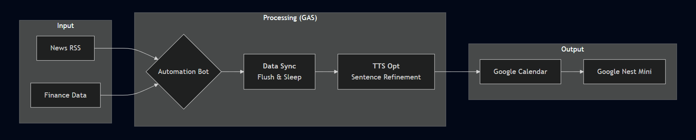
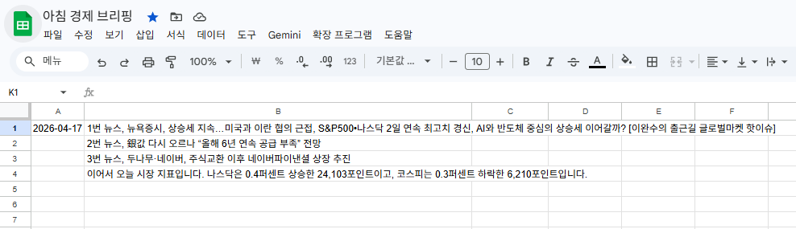
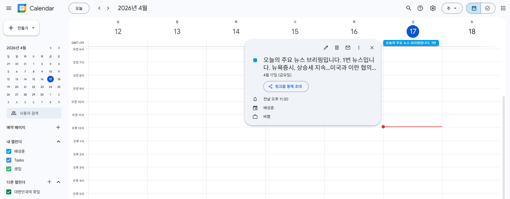

<p align="center">
  
</p>

# 🤖 Smart Morning Briefing Bot
> **Google Nest Mini 연동 아침 경제 뉴스 및 시장 지표 브리핑 자동화 시스템**

[](https://opensource.org/licenses/MIT)
[](https://developers.google.com/apps-script)

Google Apps Script(GAS)를 활용하여 매일 아침 구글 네스트 미니를 통해 개인화된 브리핑을 제공합니다. 뉴스 RSS와 Google Finance의 실시간 데이터를 가공하여 구글 캘린더에 등록함으로써, 별도의 화면 확인 없이 음성으로만 주요 정보를 파악할 수 있습니다.

---

## 🛠️ Tech Stack (기술 스택)
- Language : JavaScript (Google Apps Script)
- Platform : Google Cloud Infrastructure
- Integrations : Google Spreadsheet API, Google Calendar API, Google Finance API
- Hardware : Google Nest Mini (Google Home Ecosystem)

---

## 🔄 Workflow (시스템 흐름도)

<p align="center">
 
  <br>
  <em>전체적인 시스템 흐름도</em>
</p>

### 💡 흐름도 설명
* **Input** : 실시간 뉴스 및 지표 수집
* **Process** : Google Apps Script를 통한 문장 최적화 및 자동화
* **Output** : 구글 캘린더 동기화 및 네스트 미니 음성 출력

---

## 🖥️ Execution Result (시트 실행 결과)

<p align="center">
  
  <br>
  <em>스크립트 실행 후 데이터가 자동으로 기록된 스프레드시트 화면</em>
</p>

| 셀 위치 | 주요 내용 | 상세 설명 |
| :--- | :--- | :--- |
| **A1** | **Execution Date** | 스크립트가 실행된 날짜가 자동으로 기록됩니다. |
| **B1 - B3** | **Daily News** | 인베스팅닷컴 RSS에서 수집된 실시간 주요 뉴스 헤드라인 3건입니다. |
| **B4** | **Market Briefing** | **나스닥/코스피 변동률(%)**을 계산하여 구글 네스트 낭독용 문장으로 완성됩니다. |

<br>

<p align="center">
  
  <br>
  <em>구글 캘린더에 '종일 일정'으로 등록된 최종 브리핑 본문 화면</em>
</p>

---

## 💻 Configuration (환경 설정)

사용자는 `Code.gs` 상단의 `CONFIG` 객체만 수정하여 시스템을 커스터마이징할 수 있습니다.

```javascript
/**
 * Line 12: 사용자 구글 시트 ID
 */
...
const CONFIG = {
  SHEET_ID: "구글 시트 고유 ID 여기 넣으시오",                 // 구글 시트 고유 ID (~spreadsheets/d/(여기가 구글 시트 ID)/edit?~)
  RSS_URL: 'https://kr.investing.com/rss/news_285.rss',      // 투자 뉴스 RSS 주소
...
```

---

© 2026 Seong-hun Bae.
